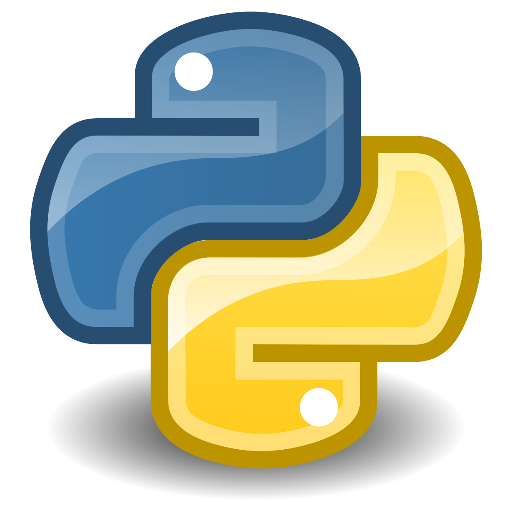
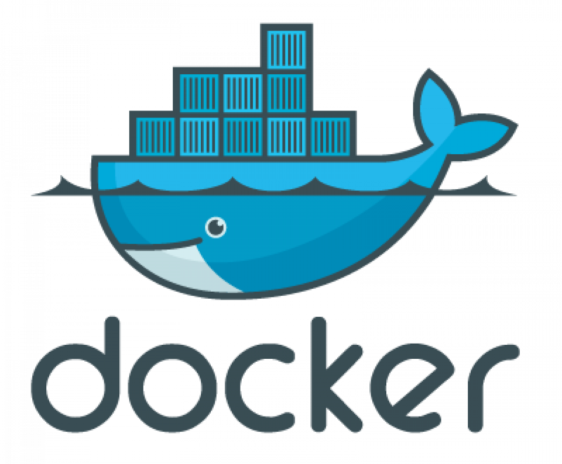

## Hey 🖐, I'm Paweł!

I am currently trying to learn new things related to Python and Fast API, Django. I'm also learning docker in my free time

- 🔭 I’m currently working on a own project Fast API.
- 
✍ I’m currently learning &nbsp;&nbsp;&nbsp;&nbsp;&nbsp;

- 
💬 Ask me about   <strong>beekeeping. I will know a little about it.</strong>

- 📫 How to reach me:   <strong>You can write to me on </strong>[pawel.rutkowski001@gmail.com](mailto:pawel.rutkowski001@gmail.com)
- 
⚡ Fun fact:   <strong>I was dealing with it for the first time when I had python training in high school 2017 where the school limited training for everyone it was my first time with python</strong>

- 
🎯 Goal (2026):   <strong>Learn aws.</strong>

- 
📖 Currently reading books: <a href="https://helion.pl/ksiazki/nauka-dockera-w-miesiac-elton-stoneman,naudoc.htm#format/d)https://helion.pl/ksiazki/nauka-dockera-w-miesiac-elton-stoneman,naudoc.htm#format/d" target="_blank">Nuka Dockera w Miesiąc</a>, <a href="https://helion.pl/ksiazki/era-agile-o-tym-jak-sprytne-firmy-ksztaltuja-swoja-efektywnosc-stephen-denning,eragil.htm#format/d" target="_blank">Era Agile</a>, <a href="https://helion.pl/ksiazki/mistrz-czystego-kodu-kodeks-postepowania-profesjonalnych-programistow-robert-c-martin,mckkvv.htm#format/d" target="_blank">Mistrz czystego kodu</a>

Hey 👋, I'm Paweł!
Python developer exploring the backend world — currently diving deep into FastAPI, Django, Docker, and AWS.

🔭 What I'm working on
Building my own project with FastAPI
🛠️ Tech I'm learning
[Show Image](https://img.shields.io/badge/Python-3776AB?style=for-the-badge&logo=python&logoColor=white)
[Show Image](https://img.shields.io/badge/FastAPI-009688?style=for-the-badge&logo=fastapi&logoColor=white)
[https://img.shields.io/badge/Django-092E20?style=for-the-badge&logo=django&logoColor=white](https://img.shields.io/badge/Django-092E20?style=for-the-badge&logo=django&logoColor=white)
[Show Image](https://img.shields.io/badge/Docker-2496ED?style=for-the-badge&logo=docker&logoColor=white)
[Show Image](https://img.shields.io/badge/AWS-232F3E?style=for-the-badge&logo=amazonwebservices&logoColor=white)
🎯 2026 Goal
Learn AWS and get comfortable with cloud deployments
📖 Currently reading

Nauka Dockera w Miesiąc — Elton Stoneman
Era Agile — Stephen Denning
Mistrz Czystego Kodu — Robert C. Martin

💬 Ask me about
Beekeeping 🐝 — I know a thing or two!
⚡ Fun fact
My first encounter with Python was during a high school training in 2017 — and I've been hooked ever since
